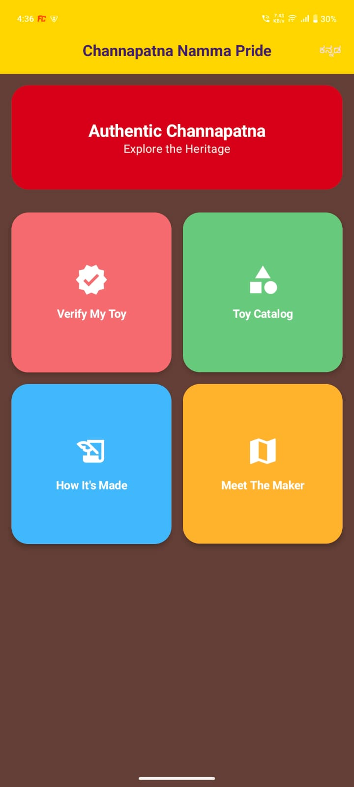
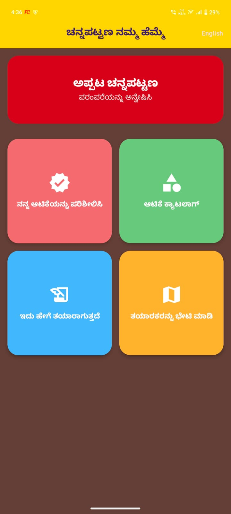
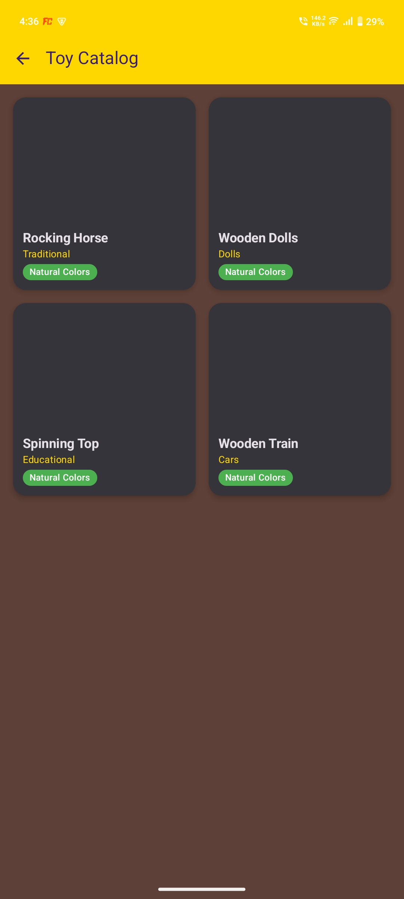

# 🎨 Channapatna-Namma Pride

An Android application built using GenAI that promotes and protects the heritage of authentic Channapatna wooden toys.  
The app helps buyers verify genuine toys, discover artisan stories, and learn about the traditional eco-friendly toy-making process.

---

# 📸 Project Screenshots

## Home Screen

## Toy Verification

## Artisan Profile

## Meet the Maker

## Toy Catalog

## Traditional Craft Showcase

---

# ✨ Features

- 🔍 Verify authentic Channapatna toys using unique IDs
- 👨‍🎨 View artisan profiles and workshop details
- 🎥 Learn how traditional toys are made using natural lac dyes
- 🧸 Browse colorful toy catalogs
- 📍 Meet local toy makers and workshops
- 🌐 Kannada language support
- 🌱 Promote eco-friendly and non-toxic toys

---

# 🛠 Tech Stack Used

- **Kotlin** – Android app development
- **Jetpack Compose** – Modern UI toolkit
- **MVVM Architecture** – Clean architecture pattern
- **Firebase Firestore** – Real-time database storage
- **Firebase Authentication** – User authentication
- **Navigation Component** – Screen navigation
- **Hilt** – Dependency Injection
- **Coil** – Image loading
- **Material Design 3** – Vibrant and modern UI
- **Android Studio** – Development IDE

---

# 📱 App Modules

## 🏠 Verify My Toy
Enter a unique 6-digit toy ID to verify authenticity and view artisan details.

## 🎨 How It’s Made
Educational section explaining traditional toy-making techniques using Hale wood and natural lac colors.

## 👨‍🔧 Meet the Maker
Explore workshops and artisan profiles from Channapatna.

## 🧸 Toy Catalog
Browse traditional wooden toy collections including rocking horses, puzzles, and decorative crafts.

---

# 📂 Project Structure

- `data/` → Firebase & repository implementations
- `domain/` → Models, business logic, interfaces
- `presentation/` → UI screens and ViewModels
- `navigation/` → App navigation routes
- `ui/theme/` → Custom colorful UI themes
- `di/` → Hilt dependency injection modules

---

# 🔥 Firebase Configuration

1. Create a Firebase project
2. Add Android app package
3. Download `google-services.json`
4. Place it inside the `app/` directory
5. Enable Firestore Database

---

# 🚀 Running the App

1. Clone the repository
2. Open the project in Android Studio
3. Sync Gradle files
4. Run the application on an emulator or Android device

---

# 🎯 Impact Goals

- 🛡 Protecting GI-tagged Channapatna toys
- 👨‍🎨 Giving recognition to local artisans
- 🌱 Encouraging sustainable and eco-friendly toys
- 🇮🇳 Preserving Karnataka’s cultural heritage through technology

---

# 👨‍💻 Developed By

**Abhishek Yadav**

---
